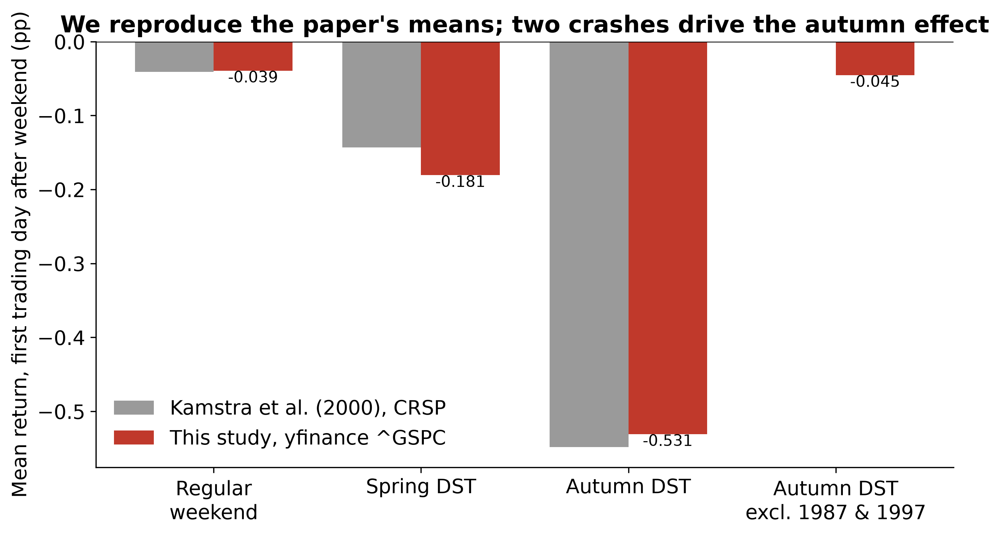
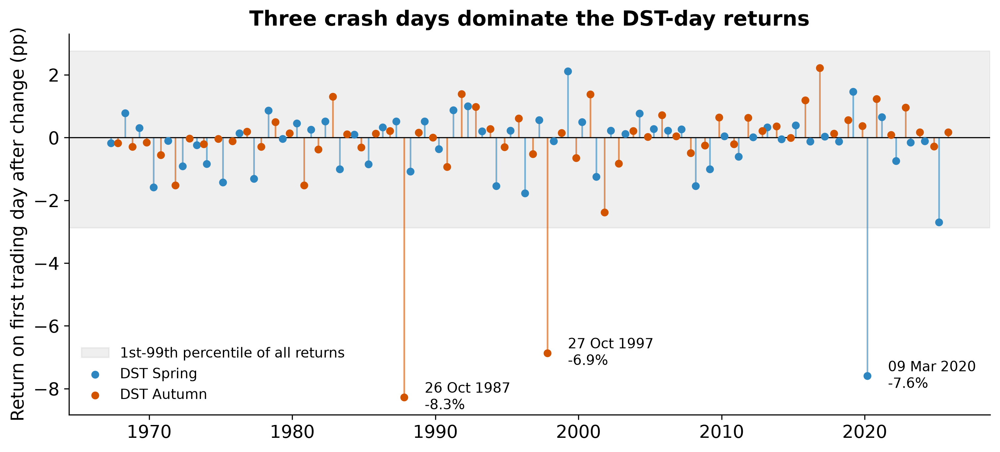
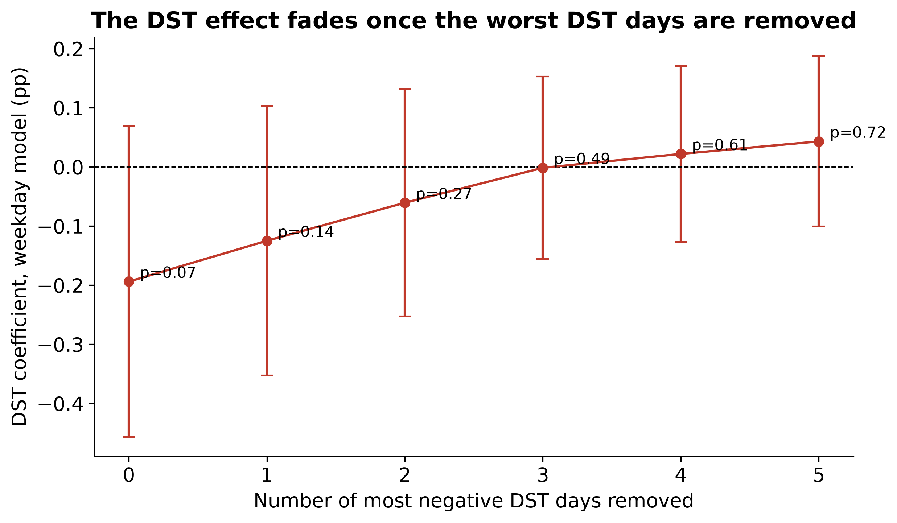

# Losing Sleep at the Market — a reproduction

Do stock-market returns fall after daylight-saving clock changes? This project reproduces the S&P 500 analysis of **Kamstra, Kramer & Levi (2000), "Losing Sleep at the Market: The Daylight Saving Anomaly", *American Economic Review* 90(4), 1005–1011**, extends the sample to 2025, and tests how stable the result is.

Coursework for *Statistical Models*, MSc Data Analytics & Artificial Intelligence, EDHEC Business School (2026–2027), Group 8.

## Research questions

1. Are average S&P 500 returns different after a daylight-saving clock change?
2. Does the difference survive an alternative calendar specification (day-of-week controls)?
3. Is the conclusion stable when extreme daily returns are treated differently?

## Key findings

- **Raw effect:** the 118 trading days that follow a clock change (1967–2025) average **−0.206%**, against **+0.038%** on other days. The estimated gap of −0.244 percentage points is significant at 1% with conventional standard errors (one-sided p = 0.007).
- **Calendar specification:** every affected day is a Monday, and ordinary Mondays are also weak (−0.013%). Comparing DST Mondays with ordinary Mondays reduces the effect to −0.194 pp. It stays significant at 5% under the paper's conventional standard errors (p = 0.026), but not with heteroskedasticity-robust ones (p = 0.074).
- **Extreme returns:** three crashes fell on DST Mondays: 26 Oct 1987 (−8.28%), 27 Oct 1997 (−6.87%) and 9 Mar 2020 (−7.60%). Winsorizing (p = 0.17) or using a median regression (p = 0.64) removes the effect. The typical post-DST day is not abnormal.
- **Reproduction:** over the paper's period (1967–1997), our means closely match the published Table 1. Without the 1987 and 1997 crashes, the paper-period autumn effect falls from −0.53% to −0.05%, in line with a regular weekend (−0.04%).

**Conclusion:** we reproduce the paper's raw pattern, but the evidence for a systematic daylight-saving anomaly in the S&P 500 is not robust. It rests on a handful of crash days.



| Specification | β DST (pp) | One-sided p, classic SE | One-sided p, robust SE |
|---|---|---|---|
| (1) Return ~ DST | −0.244 | 0.007 | 0.033 |
| (2) + weekday dummies | −0.194 | 0.026 | 0.074 |
| (3) + weekday, winsorized 1/99% | −0.085 | 0.168 | 0.163 |
| (4) + weekday, without 2 most influential DST days | −0.061 | 0.273 | 0.268 |
| (5) Median regression + weekday | +0.027 | — | 0.635 |





## Method

- **Data:** daily adjusted closing prices of the S&P 500 (`^GSPC`) from Yahoo Finance via `yfinance`, 3 Jan 1967 – 31 Dec 2025. Returns are R_t = 100 × (P_t / P_{t−1} − 1), giving 14,847 daily returns.
- **Clock changes:** every UTC-offset change in the `America/New_York` time zone, found with `zoneinfo`: 118 transitions (59 spring, 59 autumn), saved in `us_dst_transition_dates.csv`.
- **Event day:** the first trading day strictly after each Sunday transition, so its return runs from Friday's close to Monday's close, as in the original paper.
- **Models:** OLS of returns on a DST dummy, then with day-of-week dummies. One-sided tests of H₁: β < 0, with conventional (as in the paper) and heteroskedasticity-robust (HC1) standard errors.
- **Robustness:** location of extreme returns, leave-one-out influence, winsorization at the 1st/99th percentiles, and median (quantile) regression.
- **Comparison with the paper:** DST weekends against regular weekends over 1967–1997, matching the paper's Table 1.

## How to run

The environment is managed with [uv](https://docs.astral.sh/uv/). Python and package versions are pinned in `pyproject.toml` and `uv.lock`.

```bash
git clone https://github.com/Kaz4510/Losing_sleep_recreation.git
cd Losing_sleep_recreation
uv sync
uv run --with jupyter jupyter lab losing_sleep.ipynb
```

The notebook downloads the price data itself, so no local data files are needed. Running it end to end regenerates all tables, figures and the transition CSV.

## Repository contents

| File | Contents |
|---|---|
| `losing_sleep.ipynb` | Full analysis: data, sample construction, regressions, robustness, figures |
| `us_dst_transition_dates.csv` | The 118 DST transitions and the trading day each one affects |
| `fig1_*.png` – `fig5_*.png` | Figures generated by the notebook |
| `pyproject.toml`, `uv.lock`, `.python-version` | Reproducible environment |

## Limitations

- Only 118 events, so the tests have limited power, and a few days can dominate the mean.
- Observational design: we cannot tell coincidence from a sleep-related amplification of reactions to bad news.
- Close-to-close returns mix weekend news with Monday trading.
- A single large-cap price index. The original paper finds stronger effects in equal-weighted, small-firm indices, and used CRSP data rather than Yahoo Finance.

## Reference

Kamstra, M. J., Kramer, L. A., & Levi, M. D. (2000). Losing sleep at the market: The daylight saving anomaly. *American Economic Review*, 90(4), 1005–1011.

The original paper is not included in this repository for copyright reasons.

## Authors

Group 8, EDHEC Business School. <!-- Add team members' names here, with their agreement. -->
